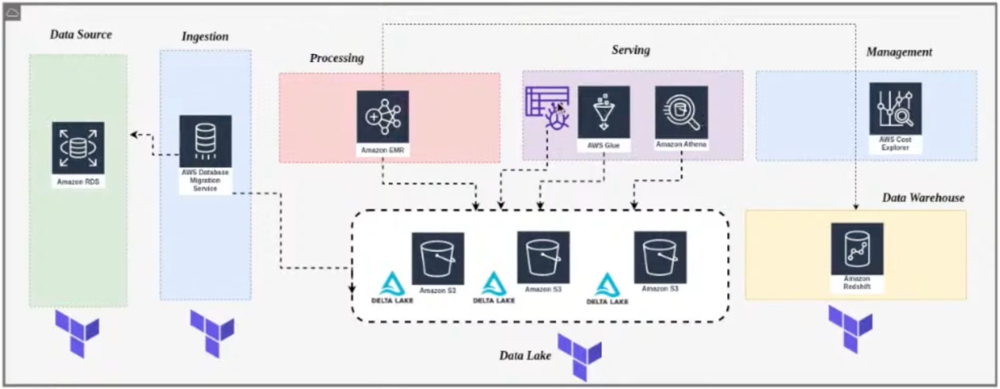

# Engenharia de Dados - Projeto Cripto.
Link: https://github.com/medeirosraphael/Pipeline-Eng-Dados-aws-Projeto-Cripto

### Para rodar a aplicação de ingestão faça:

0. Como persistir dados de uma API? 
- API Cripto: https://coinmarketcap.com/api/
- Documentação: https://coinmarketcap.com/api/documentation/v1/
- Configurar acesso a API da CoinMarket:
- API Key: 
1. Como subir um banco de dados relacional na Cloud?
- Provisionando um RDS PostgreSQL na AWS:
2. Crie um banco de dados, por exemplo: coins
3. Configure o arquivo model.py com o nome da tabela a ser criada, exemplo: tb_coins.
4. Edite variável `db_string` com o endpoint do RDS na AWS.
5. Altere o arquivo app.py inserindo a chave da api como argumento da função get_data (key)
6. Execute a aplicação para consumo da API e persistência no banco de dados.

### Arquitetura da Solução

### Para rodar a aplicação Spark:
1. Suba o Amazon EMR.

2. Navegue até o diretório `processing`

3. Copie a aplicação para o servidor usando o comando `scp`, exemplo:

<code>scp -i ~/Downloads/pair-bootcamp.pem job-spark-app-emr-redshift.py hadoop@ec2-54-90-3-194.compute-1.amazonaws.com:/home/hadoop/ </code>

4. Conecte no servidor master usando `ssh`, exemplo:

<code> ssh -i ~/Downloads/pair-bootcamp.pem hadoop@ec2-54-90-3-194.compute-1.amazonaws.com </code>

*Obs*: Antes de executar a aplicação verifique se o redshift está iniciado, caso não esteja edite a aplicação alterando a variável `flag_write_redshift` para false.

5. Execute o comando spark-submit, exemplo:
<code>spark-submit --packages io.delta:delta-core_2.12:2.0.0 --conf "spark.sql.extensions=io.delta.sql.DeltaSparkSessionExtension" --conf "spark.sql.catalog.spark_catalog=org.apache.spark.sql.delta.catalog.DeltaCatalog"  --jars /usr/share/aws/redshift/jdbc/RedshiftJDBC.jar,/usr/share/aws/redshift/spark-redshift/lib/spark-redshift.jar,/usr/share/aws/redshift/spark-redshift/lib/spark-avro.jar,/usr/share/aws/redshift/spark-redshift/lib/minimal-json.jar job-spark-app-emr-redshift.py</code>

### Para provisionar recursos com Terraform:
1. Navegue até o diretório `Terraform`

2. Instale o aplicativo `terraform`

3. Instale o aplicativo `aws-cli`. Veja esse link: https://docs.aws.amazon.com/cli/latest/userguide/getting-started-install.html

4. Autentique na AWS com o comando:

<code>aws configure</code>

5. Antes de provisionar os recursos crie o backend para usar como *backend* e a tabela no Dynamodb.

6. Edite os arquivos *terraform.tfvars* e *variables.tf* com as informações da sua infraestrutura.

7. Provisione os recursos com os comandos:

Provisione os recursos com o comando:

<code>terraform init></code>

<code>terraform plan></code>

<code>terraform apply></code>

3. Copie a aplicação para o servidor usando o comando `scp`, exemplo: